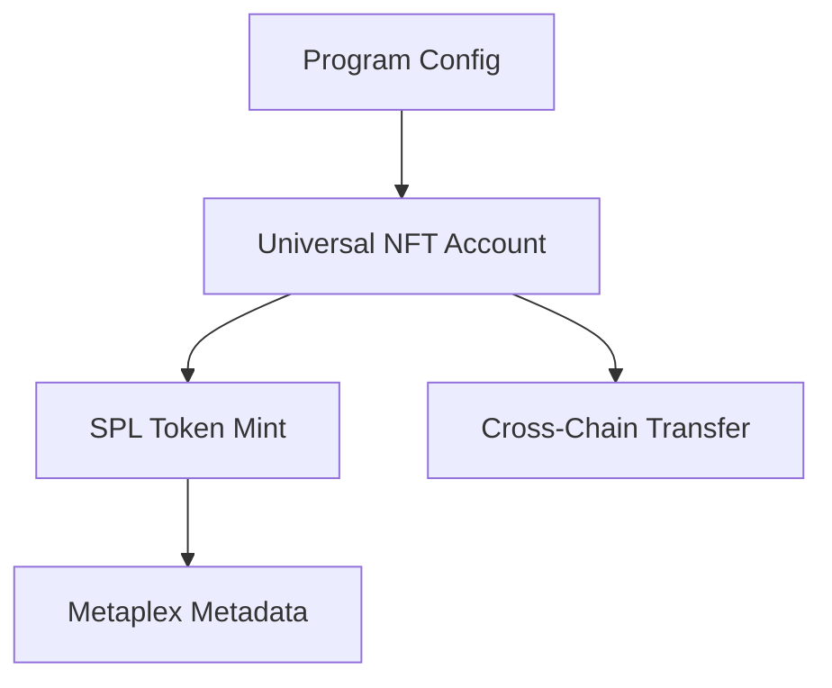

# Architecture Overview

## System Design

The ZetaChain Solana Universal NFT system is designed as a comprehensive cross-chain NFT solution that enables seamless transfers between Solana and other blockchains via ZetaChain's universal protocol.

## Core Components

### 1. Universal NFT Program

The main Solana program that handles:
- NFT minting with cross-chain compatibility
- Metadata management using Metaplex standards
- Cross-chain message processing
- Security verification via TSS signatures

```rust
// Core program structure
#[program]
pub mod universal_nft {
    // Program instructions
}
```

### 2. State Management

#### Program Configuration
- Stores global program settings
- Manages gateway and TSS authorities
- Implements pause functionality for emergency situations

#### Universal NFT Account
- Tracks NFT metadata and ownership
- Maintains cross-chain origin information
- Handles locking state for transfers

#### Cross-Chain Transfer State
- Records transfer transactions
- Tracks status across chains
- Prevents replay attacks with nonces

### 3. Cross-Chain Integration

#### Gateway Communication
- Interfaces with ZetaChain's protocol-contracts-solana
- Handles message routing between chains
- Processes `on_call` and `on_revert` operations

#### Message Protocol
```rust
pub enum CrossChainMessage {
    MintNft { /* fields */ },
    BurnNft { /* fields */ },
    TransferOwnership { /* fields */ },
    UpdateMetadata { /* fields */ },
}
```

### 4. Security Layer

#### TSS Verification
- Validates signatures from ZetaChain's Threshold Signature Scheme
- Prevents unauthorized cross-chain operations
- Supports batch verification for efficiency

#### Replay Protection
- Nonce-based message ordering
- Hash validation for message integrity
- Origin verification for instruction calls

## Program Flow

### NFT Minting
1. Validate metadata inputs
2. Generate unique token ID
3. Create mint account and token metadata
4. Initialize Universal NFT tracking account
5. Mint token to specified owner

### Cross-Chain Transfer
1. Lock NFT on source chain
2. Burn token and emit transfer event
3. Route message through ZetaChain gateway
4. Verify and process on destination chain
5. Mint equivalent NFT with same metadata

### Signature Verification
1. Receive message with ECDSA signature
2. Recover public key from signature
3. Verify against authorized TSS authority
4. Process message if valid

## Account Structure

### Program Derived Addresses (PDAs)

```
Config: seeds = ["config"]
Universal NFT: seeds = ["universal_nft", mint_pubkey]
Transfer: seeds = ["transfer", mint_pubkey, nonce]
Collection: seeds = ["collection", collection_mint]
```

### Account Relationships



## Security Model

### Authority Hierarchy
1. **Program Authority**: Can update program configuration
2. **Gateway Authority**: Authorized to process cross-chain calls
3. **TSS Authority**: ZetaChain's threshold signature authority
4. **NFT Owner**: Can transfer and update owned NFTs

### Attack Prevention
- **Replay Attacks**: Prevented via nonce validation
- **Unauthorized Minting**: TSS signature verification required
- **Reentrancy**: Single-responsibility instruction design
- **Front-running**: Deterministic token ID generation

## Optimization Features

### Compute Budget Management
- Efficient instruction design within Solana limits
- Batch operations where possible
- Minimal account space usage

### Memory Optimization
- Fixed-size account structures
- Efficient borsh serialization
- Strategic use of optional fields

### Network Efficiency
- Minimal cross-program invocations
- Optimized account lookup tables
- Efficient PDA derivation

## Integration Points

### ZetaChain Gateway
- Standardized message format
- Error handling and revert mechanisms
- Gas limit management

### Metaplex Integration
- Full Token Metadata program compatibility
- Master Edition support for unique NFTs
- Collection verification system

### SPL Token Compatibility
- Standard token account management
- Associated token account creation
- Transfer and approval mechanisms

## Future Extensibility

### Plugin Architecture
The system is designed to support future extensions:
- Additional metadata standards
- New chain integrations
- Enhanced security features
- Advanced collection management

### Upgrade Path
- Program upgrades via authority
- Backward compatibility maintenance
- State migration strategies
- Version management system