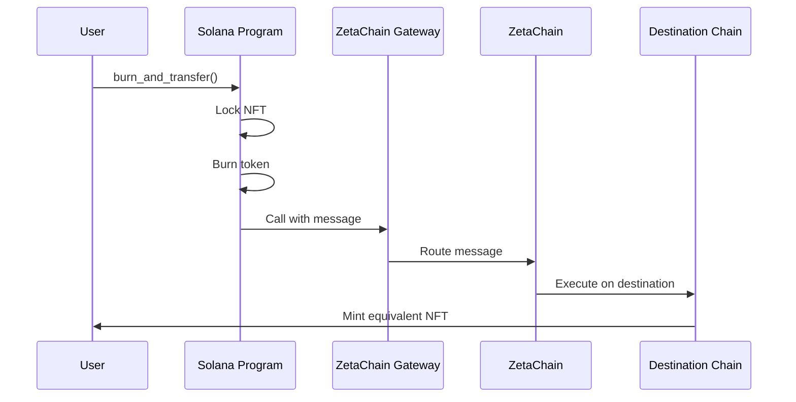
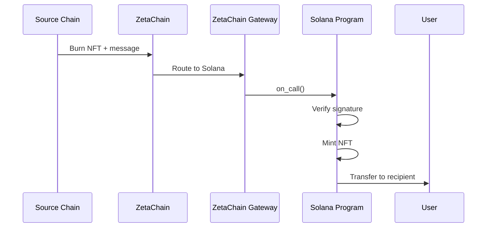

# Cross-Chain Integration Guide

## Overview

This guide explains how to integrate the Universal NFT program with ZetaChain's cross-chain infrastructure for seamless NFT transfers between Solana and other supported blockchains.

## Supported Chains

### Current Support
- **Solana**: Native chain with full functionality
- **ZetaChain**: Universal hub for cross-chain operations
- **Ethereum**: Via ZetaChain bridge
- **BNB Chain**: Via ZetaChain bridge

### Chain IDs
```typescript
const CHAIN_IDS = {
  SOLANA: 900,           // Custom Solana identifier
  ZETACHAIN_MAINNET: 7000,
  ZETACHAIN_TESTNET: 7001,
  ETHEREUM_MAINNET: 1,
  ETHEREUM_GOERLI: 5,
  BSC_MAINNET: 56,
  BSC_TESTNET: 97,
};
```

## Cross-Chain Message Flow

### 1. Outbound Transfer (Solana → Other Chain)



#### Implementation Example

```typescript
// Burn NFT on Solana and transfer to Ethereum
const destinationChainId = CHAIN_IDS.ETHEREUM_MAINNET;
const ethereumRecipient = "0x742d35Cc6634C0532925a3b8D474C2f83C1b3d4C"; // 20 bytes
const gasLimit = 100000;

const tx = await program.methods
  .burnAndTransfer(
    new anchor.BN(destinationChainId),
    Array.from(Buffer.from(ethereumRecipient.slice(2), 'hex')),
    new anchor.BN(gasLimit)
  )
  .accounts({
    config: configPda,
    universalNft: universalNftPda,
    transfer: transferPda,
    mint: mint.publicKey,
    tokenAccount: tokenAccount,
    owner: owner.publicKey,
    gatewayProgram: gatewayProgramId,
    tokenProgram: TOKEN_PROGRAM_ID,
    systemProgram: SystemProgram.programId,
  })
  .signers([owner])
  .rpc();
```

### 2. Inbound Transfer (Other Chain → Solana)



#### Message Processing

```rust
// Handle incoming cross-chain message
pub fn on_call(
    ctx: Context<OnCall>,
    sender: [u8; 20],           // Ethereum-style sender address
    source_chain_id: u64,       // Source blockchain ID
    message: Vec<u8>,           // Encoded CrossChainMessage
) -> Result<()> {
    // Verify call origin
    verify_instruction_origin(&ctx.accounts.instructions_sysvar)?;
    
    // Parse message
    let cross_chain_msg: CrossChainMessage = borsh::from_slice(&message)?;
    
    // Process based on message type
    match cross_chain_msg {
        CrossChainMessage::MintNft { token_id, name, symbol, uri, recipient, collection_mint } => {
            // Mint NFT on Solana with cross-chain origin
            handle_mint_from_cross_chain(ctx, token_id, name, symbol, uri, recipient, collection_mint, source_chain_id)
        }
        // ... handle other message types
    }
}
```

## Message Format

### CrossChainMessage Structure

```rust
#[derive(AnchorSerialize, AnchorDeserialize, Clone)]
pub enum CrossChainMessage {
    /// Mint NFT on destination chain
    MintNft {
        token_id: String,                // Unique token identifier
        name: String,                    // NFT name
        symbol: String,                  // NFT symbol
        uri: String,                     // Metadata URI
        recipient: Pubkey,               // Destination owner
        collection_mint: Option<Pubkey>, // Optional collection
    },
    /// Burn NFT and return to origin
    BurnNft {
        token_id: String,
        owner: Pubkey,
    },
    /// Transfer ownership without chain change
    TransferOwnership {
        token_id: String,
        new_owner: Pubkey,
    },
    /// Update NFT metadata
    UpdateMetadata {
        token_id: String,
        new_uri: String,
        new_name: Option<String>,
        new_symbol: Option<String>,
    },
}
```

### Serialization

```typescript
// Serialize message for cross-chain transfer
const message = {
  mintNft: {
    tokenId: "unique_token_id",
    name: "My Universal NFT",
    symbol: "MUNFT",
    uri: "https://example.com/metadata.json",
    recipient: new PublicKey("recipient_address"),
    collectionMint: null,
  }
};

const serializedMessage = borsh.serialize(CrossChainMessageSchema, message);
```

## Gateway Integration

### ZetaChain Gateway Interface

```rust
// Gateway program interface (simplified)
pub mod zetachain_gateway {
    pub fn call(
        destination_chain_id: u64,
        recipient: Vec<u8>,
        message: Vec<u8>,
        gas_limit: u64,
    ) -> Result<()>;
    
    pub fn deposit_and_call(
        destination_chain_id: u64,
        recipient: Vec<u8>,
        message: Vec<u8>,
        gas_limit: u64,
        amount: u64,
    ) -> Result<()>;
}
```

### Integration Example

```rust
// Create gateway call instruction
fn create_gateway_call_instruction(
    gateway_program: Pubkey,
    destination_chain_id: u64,
    recipient: Vec<u8>,
    message: Vec<u8>,
    gas_limit: u64,
) -> Result<Instruction> {
    let instruction_data = [
        &[0u8], // Instruction discriminator for "call"
        &destination_chain_id.to_le_bytes(),
        &(recipient.len() as u32).to_le_bytes(),
        &recipient,
        &(message.len() as u32).to_le_bytes(),
        &message,
        &gas_limit.to_le_bytes(),
    ].concat();

    Ok(Instruction {
        program_id: gateway_program,
        accounts: vec![
            // Gateway accounts
        ],
        data: instruction_data,
    })
}
```

## Security Considerations

### Signature Verification

```rust
// Verify TSS signature for cross-chain operations
pub fn verify_cross_chain_signature(
    message_hash: [u8; 32],
    signature: [u8; 64],
    recovery_id: u8,
    tss_authority: [u8; 20],
) -> Result<bool> {
    // Recover public key from signature
    let recovered_pubkey = secp256k1_recover(&message_hash, recovery_id, &signature)?;
    
    // Convert to Ethereum address
    let ethereum_address = pubkey_to_ethereum_address(&recovered_pubkey.to_bytes());
    
    // Verify against TSS authority
    Ok(ethereum_address == tss_authority)
}
```

### Replay Protection

```rust
// Prevent replay attacks with nonce validation
pub fn validate_nonce(config: &mut ProgramConfig, message_nonce: u64) -> Result<()> {
    require!(message_nonce > config.nonce, UniversalNftError::NonceMismatch);
    config.nonce = message_nonce;
    Ok(())
}
```

## Error Handling

### Revert Mechanism

```rust
// Handle failed cross-chain transactions
pub fn on_revert(
    ctx: Context<OnRevert>,
    sender: [u8; 20],
    source_chain_id: u64,
    message: Vec<u8>,
) -> Result<()> {
    let transfer = &mut ctx.accounts.transfer;
    
    // Update transfer status
    transfer.status = TransferStatus::Reverted;
    
    // Unlock NFT
    let universal_nft = &mut ctx.accounts.universal_nft;
    universal_nft.is_locked = false;
    
    // Additional cleanup...
    Ok(())
}
```

### Error Recovery

```typescript
// Monitor transfer status and handle failures
async function monitorTransfer(transferPda: PublicKey) {
  const transfer = await program.account.crossChainTransfer.fetch(transferPda);
  
  switch (transfer.status) {
    case 'Initiated':
      console.log('Transfer initiated, waiting for processing');
      break;
    case 'Processing':
      console.log('Transfer in progress');
      break;
    case 'Completed':
      console.log('Transfer completed successfully');
      break;
    case 'Reverted':
      console.log('Transfer failed and reverted');
      // Handle revert logic
      break;
  }
}
```

## Gas Management

### Gas Estimation

```typescript
function estimateGasLimit(messageType: string, dataSize: number): number {
  const baseGas = {
    'MintNft': 100000,
    'BurnNft': 50000,
    'TransferOwnership': 30000,
    'UpdateMetadata': 40000,
  };
  
  const gasPerByte = 100;
  return baseGas[messageType] + (dataSize * gasPerByte);
}
```

### Fee Calculation

```typescript
// Calculate cross-chain transfer fees
async function calculateTransferFee(
  destinationChainId: number,
  gasLimit: number
): Promise<number> {
  const baseFee = 0.002 * LAMPORTS_PER_SOL; // ZetaChain base fee
  const gasFee = gasLimit * getGasPrice(destinationChainId);
  return baseFee + gasFee;
}
```

## Testing Cross-Chain Operations

### Local Development

```typescript
// Mock gateway for local testing
class MockGateway {
  async call(destinationChainId: number, recipient: string, message: Uint8Array): Promise<string> {
    // Simulate cross-chain call
    console.log(`Mock call to chain ${destinationChainId}`);
    console.log(`Recipient: ${recipient}`);
    console.log(`Message: ${Buffer.from(message).toString('hex')}`);
    
    // Return mock transaction hash
    return 'mock_tx_hash_' + Date.now();
  }
}
```

### Integration Testing

```typescript
describe("Cross-chain integration tests", () => {
  it("Should transfer NFT from Solana to Ethereum", async () => {
    // Mint NFT on Solana
    const mintTx = await mintUniversalNft(program, mint, owner, metadata);
    
    // Initiate cross-chain transfer
    const transferTx = await program.methods
      .burnAndTransfer(CHAIN_IDS.ETHEREUM_MAINNET, ethereumRecipient, gasLimit)
      .accounts({...})
      .rpc();
    
    // Verify NFT is locked and burned
    const nft = await program.account.universalNft.fetch(universalNftPda);
    expect(nft.isLocked).to.be.true;
    
    // Verify transfer record
    const transfer = await program.account.crossChainTransfer.fetch(transferPda);
    expect(transfer.status).to.equal('Initiated');
  });
});
```

## Best Practices

### 1. Message Design
- Keep messages minimal to reduce gas costs
- Use efficient serialization (borsh)
- Include all necessary verification data

### 2. Error Handling
- Always implement revert mechanisms
- Monitor transfer status on both chains
- Provide clear error messages to users

### 3. Security
- Validate all cross-chain inputs
- Implement proper signature verification
- Use nonce-based replay protection

### 4. Gas Optimization
- Estimate gas requirements accurately
- Implement fallback mechanisms for high gas periods
- Cache frequently used data

### 5. User Experience
- Provide clear transfer status updates
- Implement timeout mechanisms
- Offer manual recovery options